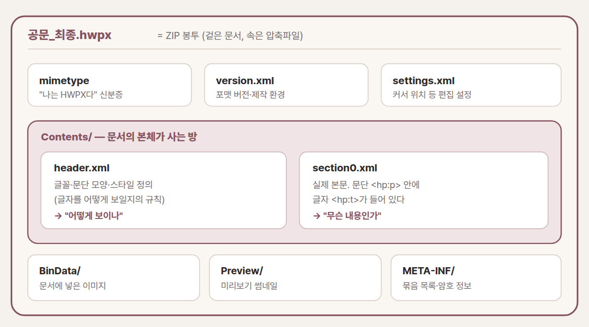

# 01. HWPX — 한글 파일의 잠긴 뚜껑을 여는 법

누군가 `공문_최종.hwpx` 파일을 보내왔습니다. 그런데 이 컴퓨터에는 한글 프로그램이 깔려 있지 않습니다. 더블클릭하면 "이 파일을 열 앱을 선택하세요"라는 창만 뜹니다. 대부분은 여기서 포기합니다. 한글을 설치할 방법을 알아보거나, 보낸 사람에게 PDF로 다시 보내 달라고 부탁하지요.

그럴 필요가 없습니다. 이 파일은 사실 압축파일입니다. 겉으로는 한글 문서처럼 보이지만, 속을 열어 보면 여러 개의 작은 파일이 폴더 구조로 담겨 있는 상자입니다. 그리고 그 상자를 여는 열쇠는 특별한 프로그램이 아니라, 이미 여러분 컴퓨터 안에 들어 있는 압축 해제 기능입니다.

이 사실 하나를 알면 두 가지가 달라집니다. 첫째, 한글이 없는 컴퓨터에서도 문서의 내용을 꺼내 읽을 수 있습니다. 둘째, 그리고 이쪽이 훨씬 중요한데, 이름과 날짜만 다른 공문 백 장을 만드는 일을 사람이 아니라 도구에게 넘길 수 있게 됩니다. 이 장은 그 두 번째 이야기를 하기 위해 첫 번째부터 시작합니다.

## 확장자는 겉옷일 뿐입니다

`.hwpx`는 한글과컴퓨터가 만든 문서 형식입니다. 우리가 오래 써 온 `.hwp`와 이름은 한 글자 차이지만 속은 전혀 다릅니다. 옛 `.hwp`는 이진 파일이라 만든 회사의 프로그램이 아니면 속을 들여다보기 어려웠습니다. 공공기관이 만든 문서를 시민 누구나 열어볼 수 있어야 한다는 요구가 커지면서, 한글은 문서 형식을 개방형으로 다시 설계했습니다. 그 결과가 `.hwpx`이고, 그 설계의 정식 이름은 OWPML입니다.

정체를 한 문장으로 말하면 이렇습니다. **HWPX는 여러 개의 XML 파일을 ZIP으로 묶은 문서 상자입니다.**

낯선 단어는 두 개뿐이고, 둘 다 어렵지 않습니다. ZIP은 이미 익숙하실 겁니다. 여러 파일을 하나로 압축해 담는 봉투지요. XML은 글자에 이름표를 붙여 정리해 둔 텍스트 형식입니다. 이를테면 `<제목>예산안</제목>`처럼 내용마다 여는 표와 닫는 표로 감싸 둡니다. 사람이 읽어도 뜻을 짐작할 수 있고, 프로그램은 그 표를 보고 필요한 자리를 정확히 찾아냅니다.

그러니 봉투를 풀면 이름표가 붙은 글자들이 그대로 나옵니다. 암호도 아니고 특수한 기술도 아닙니다. 그냥 상자이고, 그 안에 이름표 붙은 종이가 들어 있을 뿐입니다.

여기서 미리 말씀드릴 것이 하나 있습니다. 이 구조는 한글만의 것이 아닙니다. 워드의 `.docx`, 엑셀의 `.xlsx`, 파워포인트의 `.pptx`, 전자책의 `.epub`이 모두 같은 방식으로 만들어져 있습니다. 지금 여는 것은 한글 파일 하나지만, 손에 쥐게 되는 것은 다섯 개 포맷을 여는 같은 열쇠입니다.

## 상자를 열어봅니다

말로 듣는 것과 직접 열어 보는 것은 다릅니다. 프로그램을 새로 설치할 필요도 없고, 명령어를 외울 일도 없습니다. 윈도우 탐색기나 맥 파인더만으로 충분합니다.

[[TIP("손으로 해보기 · 마우스만으로")]]
1. **확장자를 보이게 합니다.** 윈도우 탐색기 상단 '보기'에서 '파일 확장명'에 체크합니다. 맥은 파일 정보에서 이름 끝을 확인합니다.
2. **사본을 하나 만듭니다.** 원본이 상하지 않도록 `공문_최종.hwpx`를 복사해 둡니다.
3. **확장자를 바꿉니다.** 사본 이름의 `.hwpx`를 `.zip`으로 고칩니다. "정말 바꾸겠냐"는 경고에는 예를 누릅니다.
4. **압축을 풉니다.** 우클릭 후 '압축 풀기'를 누르면 `Contents` 폴더가 보입니다.
5. **속을 확인합니다.** `Contents/section0.xml`을 메모장이나 브라우저로 열어 봅니다. 낯선 태그 사이에 문서의 진짜 글자가 보입니다.

되돌리기는 걱정하지 않으셔도 됩니다. 방금 만든 것은 사본이니 통째로 지워도 원본은 그대로입니다.
[[/TIP]]

압축을 풀면 `mimetype`, `Contents` 폴더, `settings.xml` 같은 이름들이 줄줄이 나타납니다. 이 목록을 처음 본 사람은 대개 같은 반응을 보입니다. 한글 파일 안이 이렇게 생겼다고?



*그림 1. HWPX를 압축 해제하면 나오는 방 배치. 글자를 바꾸고 싶다면 목적지는 단 하나, `Contents/section0.xml`입니다.*

상자 안은 아무렇게나 담겨 있지 않습니다. 방마다 역할이 정해져 있습니다. 이름만 봐서는 짐작이 어려우니 한 번만 정리해 두겠습니다. 앞으로 이 표를 다시 볼 일은 거의 없을 겁니다.

| 파일 · 폴더 | 맡은 일 | 손대도 되나 |
|---|---|---|
| `mimetype` | "이 파일은 HWPX"라는 신분증 | 건드리지 않습니다 |
| `Contents/header.xml` | 글꼴·문단·스타일의 정의 | 서식을 바꿀 때만 |
| `Contents/section0.xml` | 본문 글자가 담긴 곳 | **여기를 바꿉니다** |
| `settings.xml` | 커서 위치 같은 편집 상태 | 보통 그대로 둡니다 |
| `BinData/` | 문서에 넣어 둔 이미지 | 그림을 교체할 때만 |

기억할 것은 사실상 하나입니다. 글꼴과 문단 모양의 규칙은 `header.xml`에 있고, 실제로 무슨 글자가 적혀 있는지는 `section0.xml`에 있습니다. 우리가 읽거나 바꾸고 싶을 때 찾아갈 곳은 언제나 `section0.xml` 하나입니다.

## 공문 백 장을 몇 초에

여기까지가 "열어 보기"였습니다. 진짜 이야기는 지금부터입니다.

받는 사람 이름과 날짜만 다른 안내 공문을 백 명에게 보내야 한다고 해 봅시다. 손으로 하면 방법은 하나뿐입니다. 한글을 열고, 이름을 지우고, 새 이름을 타이핑하고, 다른 이름으로 저장하고, 다시 이름을 지우고. 백 번을 반복하면 한나절이 지나가 있습니다. 그리고 서른 번째쯤부터는 실수가 시작됩니다. 이건 집중력의 문제가 아니라 사람이 할 일이 아니어서 생기는 일입니다.

구조를 알면 이 일은 세 동작으로 줄어듭니다. 상자를 열고, 본문이 든 방에서 이름표가 붙은 글자만 갈아 끼우고, 다시 봉투로 묶습니다. 압축을 풀고, `section0.xml`의 글자를 바꾸고, 다시 압축하는 것이지요. 바꿔 넣을 이름 목록은 이미 엑셀이나 CSV로 갖고 계실 겁니다. 그 목록의 줄 수만큼 이 세 동작을 반복하면 됩니다. 사람에게는 반나절짜리 일이지만, 도구에게는 몇 초짜리 일입니다.

이 방식에는 이름이 있습니다. 원본 상자의 구조는 조금도 손대지 않고 글자만 갈아 끼운다고 해서 **템플릿 보존 방식**이라고 부릅니다. 이름이 붙어 있다는 건 이미 검증된 방법이라는 뜻이기도 합니다.

이 방식의 미덕은 두 가지입니다. 구조를 건드리지 않으니 만들어진 문서가 한글에서 아무 문제 없이 열립니다. 그리고 문서를 밖으로 내보내지 않습니다. 이 두 번째가 실무에서는 특히 중요합니다. 이름과 연락처가 든 공문 백 장을 인터넷 변환 사이트에 올리는 순간 개인정보는 남의 서버에 올라갑니다. 내 컴퓨터 안에서만 처리하면 그런 위험 자체가 생기지 않습니다.

다만 상자를 다시 묶을 때는 지켜야 하는 약속이 몇 가지 있습니다. 어기면 한글이 "손상된 파일"이라며 열기를 거부합니다. 사실 이 약속들이 이 장에서 가장 실전에 가까운 지식입니다.

가장 까다로운 것은 `mimetype`입니다. 이 파일은 봉투에 맨 처음 들어가야 하고, 압축하지 않은 상태로 담겨야 합니다. 순서가 밀리거나 압축이 걸리면 한글은 파일 자체를 거부합니다. 나머지 파일들도 원본에 담겨 있던 순서를 그대로 지켜야 합니다. 글자를 넣을 때는 한 문단의 첫 번째 이름표에만 넣습니다. 그렇지 않으면 같은 글자가 두 번 찍힙니다. 표는 원본에 있는 행과 열의 범위 안에서만 채웁니다. 행을 늘리는 것은 글자를 바꾸는 일이 아니라 구조를 바꾸는 일이어서, 템플릿 보존 방식의 바깥입니다. 마지막으로 본문이 사용하는 스타일 번호는 `header.xml`에 정의돼 있어야 합니다. 여기가 어긋나면 오류 없이 서식만 조용히 사라집니다.

## AI에게 시키는 법

여기서 이 책의 방향을 한 번 짚고 가겠습니다. 방금 읽은 약속들을 외워서 직접 코드를 짜실 필요는 없습니다. 규칙을 아는 이유는 코드를 쓰기 위해서가 아니라, **AI에게 정확히 지시하기 위해서**입니다. 무엇을 어디에서 어떤 규칙 아래 바꿔야 하는지 알고 있으면, 실제 작업은 AI에게 넘길 수 있습니다. 이 차이가 "알아서 해 줘"와 "이걸 이렇게 해 줘"를 가릅니다.

가장 쉬운 것부터 해 보겠습니다. 도구를 만들 것도 없이, `.hwpx` 파일을 대화형 AI에게 그대로 건네고 이렇게 물어보면 됩니다.

```text
이 .hwpx 파일은 ZIP+XML 구조야.
압축을 풀고 Contents/section0.xml 안의
<hp:t> 태그에 든 본문 텍스트만 순서대로 뽑아서
깨끗한 글로 정리해 줘. 표는 표 모양 그대로 옮겨 줘.
```

한 걸음 더 나아가면, 반복 작업을 처리할 작은 도구를 AI 코딩 도구에게 만들라고 시킬 수 있습니다. 앞에서 배운 약속들을 지시문에 그대로 적어 주는 것이 성공의 열쇠입니다.

```text
브라우저에서만 도는 HTML 파일 하나를 만들어 줘. 서버는 쓰지 마.

할 일: 템플릿 .hwpx 하나와 이름·날짜가 든 CSV를 올리면,
각 줄마다 공문 한 장을 만들어 ZIP으로 한꺼번에 내려받게 해 줘.

반드시 지킬 규칙:
· JSZip으로 hwpx를 풀고 다시 묶어.
· 본문은 section0.xml의 <hp:t>만 바꿔. 나머지 파일·순서는 그대로 둬.
· mimetype은 맨 앞에, 무압축(STORED)으로 넣어.
· 완성 파일 확장자는 다시 .hwpx로.
```

이 지시문이 잘 작동하는 이유는 분명합니다. 목적지와 바꿀 대상과 깨지지 않을 조건을 콕 집어 줬기 때문입니다. 확장자의 구조를 이해한 사람만 쓸 수 있는 지시문이고, 그래서 이 장을 읽은 값이 여기서 나옵니다.

정직하게 한계도 적어 두겠습니다. 이 방법은 글자와 간단한 표를 갈아 끼우는 데 강하지, 복잡한 도형이나 수식이 얽힌 문서를 자유롭게 재편집하는 데는 맞지 않습니다. 표의 행 수를 늘리는 일도 앞서 말씀드린 대로 이 방식의 범위 밖입니다. 그리고 AI가 만들어 준 도구라 해도 첫 결과물은 반드시 한글에서 직접 열어 확인하셔야 합니다. 열리는 것과 올바른 것은 다릅니다.

## 열쇠 하나, 문 다섯 개

이 장의 가장 큰 수확은 한글 파일을 열었다는 사실이 아닙니다. 상자를 열고, 글자가 든 XML을 찾고, 바꾸고, 다시 묶는다는 한 가지 원리를 익혔다는 것입니다. 그리고 앞에서 말씀드린 대로 이 원리는 한글의 것이 아닙니다.

여러분이 매일 쓰는 워드와 엑셀과 파워포인트가 정확히 같은 구조로 되어 있습니다. `.docx`도, `.xlsx`도, `.pptx`도 확장자를 `.zip`으로 바꾸면 그대로 열립니다. 익숙하다고 생각했던 파일들이지만, 한 번도 뚜껑을 열어 본 적은 없으셨을 겁니다. 그 안에는 한글과 비슷하면서도 사뭇 다른, 그리고 훨씬 더 많은 것을 자동화할 수 있는 구조가 들어 있습니다.

**다음 장 →** **02. DOCX · XLSX · PPTX — 매일 쓰면서 한 번도 열어보지 않은 상자**
