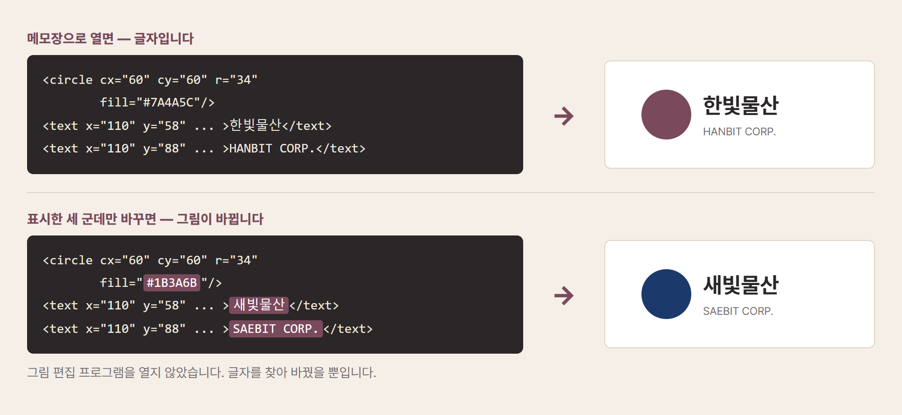

# 06. SVG — 메모장으로 열리는 그림

디자인 업체에서 회사 로고 파일을 보내왔습니다. 이름은 `logo.svg`입니다. 늘 하던 대로 더블클릭했는데 그림판이 열리지 않습니다. 오른쪽 버튼을 눌러 연결 프로그램을 뒤져 봐도 마땅한 것이 없습니다. 파일 크기를 보니 고작 4킬로바이트입니다. 로고 하나가 이렇게 작을 리가 없는데 싶어 잘못 받은 줄 알고 다시 보내 달라고 부탁합니다.

잘못 받은 것이 아닙니다. `.svg`는 그림 파일이 맞습니다. 다만 우리가 아는 그림 파일과 만들어진 방식이 완전히 다릅니다. 그래서 그림판이 열지 못하는 것이고, 그래서 크기가 그토록 작은 것입니다.

이 장에서 확인할 것은 한 문장으로 요약됩니다. **SVG는 그림을 글자로 적어 둔 파일입니다.** 제1부에서는 상자를 열어야 속이 보였고, 앞 장의 PDF에서는 글자가 좌표와 함께 적혀 있었지요. 이번에는 아예 압축도 하지 않은 채 그림 그리는 방법이 그대로 적혀 있습니다.

## 무엇으로 열고, 무엇으로 고치나

먼저 당장 여는 방법입니다. 답은 허무할 만큼 간단합니다. **웹브라우저**입니다.

`.svg` 파일을 크롬이나 엣지 창으로 끌어다 놓으면 그 자리에서 그림이 뜹니다. 설치할 것도, 계정을 만들 것도 없습니다. 브라우저가 SVG를 그리는 것은 원래 웹에서 쓰라고 만든 형식이기 때문입니다. 더블클릭했을 때 열리지 않았던 것은 형식을 지원하지 않아서가 아니라, 윈도우가 이 확장자를 어느 프로그램과 연결해야 할지 몰라서였을 뿐입니다. 파일을 오른쪽 버튼으로 눌러 연결 프로그램을 브라우저로 지정해 두면 그다음부터는 더블클릭만으로 열립니다.

고치는 쪽도 선택지가 넉넉합니다. 제대로 된 그림 편집 프로그램이 필요하다면 **잉크스케이프**(Inkscape)가 무료입니다. 어도비 일러스트레이터가 하는 일을 대부분 할 수 있고 값이 들지 않습니다. 설치가 부담스러우면 **피그마**(Figma)를 브라우저에서 무료로 쓸 수 있습니다. 워드나 파워포인트에 그대로 넣어 쓰는 것도 됩니다. 요즘 오피스는 SVG를 삽입할 수 있고, 넣은 뒤 색을 바꾸는 것까지 지원합니다.

그리고 여기 이 장의 핵심이 있습니다. **메모장으로도 고칠 수 있습니다.** 농담이 아닙니다. 방금 말한 프로그램들은 그림을 그림처럼 다루는 도구지만, SVG는 애초에 글로 적혀 있어서 글자를 고치는 것만으로 그림이 바뀝니다. 그리고 바로 이 성질이 뒤에서 이야기할 자동화의 전부입니다.

## 그림을 글자로 적는다는 것

우리가 흔히 쓰는 사진 파일, 그러니까 `.jpg`나 `.png`는 그림을 점으로 기억합니다. 가로 천 개 세로 천 개의 칸을 만들어 놓고 칸마다 무슨 색인지를 적어 두는 방식이지요. 그래서 백만 개의 색 정보가 필요하고 파일이 커집니다. 그리고 확대하면 칸이 그대로 커지기 때문에 계단처럼 우툴두툴해집니다. 로고를 현수막 크기로 키웠더니 가장자리가 지저분해지는 경험, 한 번쯤 있으실 겁니다.

SVG는 정반대입니다. 점을 기억하는 대신 **그리는 방법**을 적어 둡니다. "가운데에서 왼쪽으로 60만큼, 위에서 아래로 60만큼 떨어진 자리에 반지름 34짜리 동그라미를 그리고 자주색으로 칠해라." 이런 문장을 적어 두는 것입니다. 그래서 파일이 작고, 화면에 그릴 때마다 새로 계산해 그리므로 아무리 키워도 선이 매끈합니다. 명함 크기든 건물 외벽 크기든 파일 하나로 끝납니다. 이름도 여기서 왔습니다. Scalable Vector Graphics, 우리말로 하면 크기를 자유롭게 바꿀 수 있는 그림이라는 뜻입니다.

적어 두는 문장은 몇 가지로 정해져 있습니다. 실제 파일을 열면 아래 다섯 가지가 대부분입니다.

| 적혀 있는 것 | 그려지는 것 |
|---|---|
| `<rect>` | 네모 |
| `<circle>` | 동그라미 |
| `<line>` | 직선 |
| `<path>` | 자유로운 곡선. 로고의 복잡한 모양은 대개 이것 |
| `<text>` | 글자 |

앞선 장들에서 본 `<hp:t>`나 `<w:t>`와 생김새가 같지요. 여는 표와 닫는 표로 감싸는 그 방식입니다. 세 장을 거치며 같은 문법을 계속 만나고 계신 셈입니다.

## 직접 만들어봅니다

이 장의 실습은 조금 특별합니다. 여는 것이 아니라 **만드는 것**입니다. 메모장으로 그림을 그려 보겠습니다.

적어 넣을 내용은 이 다섯 줄입니다.

```text
<svg xmlns="http://www.w3.org/2000/svg" width="320" height="120">
  <rect width="320" height="120" fill="#F5EFE7"/>
  <circle cx="60" cy="60" r="34" fill="#7A4A5C"/>
  <text x="110" y="65" font-size="30" fill="#2B2728">한빛물산</text>
</svg>
```

[[TIP("손으로 해보기 · 메모장으로 그림 그리기")]]
1. **메모장을 엽니다.** 윈도우 시작 버튼에서 "메모장"을 검색하면 됩니다.
2. **위 다섯 줄을 그대로 적습니다.** 따옴표와 꺾쇠까지 똑같이 옮겨 적으세요.
3. **저장합니다.** 파일 형식을 "모든 파일"로 바꾸고, 이름을 `logo.svg`로 적어 바탕화면에 저장합니다. 이름 끝이 `.svg.txt`가 되지 않도록 주의하세요.
4. **브라우저로 엽니다.** 저장한 파일을 크롬 창으로 끌어다 놓습니다. 동그라미와 회사 이름이 그려진 그림이 나타납니다.
5. **고쳐 봅니다.** 메모장으로 돌아가 `한빛물산`을 다른 이름으로 바꾸고, `#7A4A5C`를 `#1B3A6B`으로 바꿔 저장한 뒤 브라우저를 새로고침하세요. 색과 이름이 바뀐 로고가 나옵니다.
[[/TIP]]

방금 하신 일을 정리하면 이렇습니다. 그림 편집 프로그램을 한 번도 열지 않고 로고를 만들었고, 회사 이름과 브랜드 색을 바꿨습니다. 글자를 찾아 바꿨을 뿐인데 그림이 바뀐 것입니다.



*그림 2. 글자를 고치면 그림이 바뀝니다. 위가 원본, 아래가 세 군데만 바꾼 결과입니다.*

## 그래서 무엇을 자동화하나

이제 이 성질이 실무에서 무엇을 바꾸는지 보겠습니다. 핵심은 하나입니다. 그림이 글자라면, **글자를 다루는 모든 방법을 그림에도 쓸 수 있습니다.** 찾아 바꾸기, 명단만큼 복제하기, 숫자를 계산해 넣기가 전부 가능해집니다.

**총무팀 이 주임의 사원증 이백 장입니다.** 상반기 공채 입사자들의 사원증을 입사일 전에 만들어야 합니다. 디자인은 하나로 정해져 있고 이름과 부서와 사번만 다릅니다. 지금은 디자인 프로그램에서 도안을 열어 세 군데를 고치고 다른 이름으로 저장하기를 이백 번 반복합니다. 한 장에 일 분씩 잡아도 세 시간이 넘고, 다 만든 뒤에 부서명 하나가 바뀌었다는 연락이 오면 처음부터 다시입니다. 워크숍 명찰, 행사 참가증, 좌석표도 사정이 같습니다. 그런데 도안이 SVG라면 이것은 앞선 장에서 본 공문 백 장과 완전히 같은 일이 됩니다. 원본 하나와 명단 하나만 있으면 됩니다.

**마케팅팀의 브랜드 색 변경입니다.** 회사 CI가 바뀌어 로고와 아이콘 수십 개의 색을 모두 갈아야 합니다. 파일마다 열어서 색을 다시 지정하는 대신, 모든 파일에서 기존 색 코드를 새 색 코드로 바꾸면 끝납니다. 어느 파일 몇 군데를 바꿨는지 목록도 남습니다. 눈으로 훑어서는 반드시 몇 개를 놓치지만 이 방식은 놓치지 않습니다.

**영업기획팀의 월간 실적 그래프입니다.** 지점별 매출 막대그래프를 매달 만들어 보고서에 넣습니다. 지금은 엑셀에서 차트를 만들고 화면을 캡처해 붙이는데, 캡처한 이미지는 확대하면 흐려지고 매달 같은 작업을 반복해야 합니다. 막대의 높이는 결국 숫자 하나로 정해지므로, 이번 달 숫자를 넣으면 막대 좌표를 계산해 SVG를 만들어 내는 방식으로 바꿀 수 있습니다. 인쇄해도 선명하고 매달 숫자만 갈아 끼우면 됩니다.

여기서 사람과 AI의 몫을 나눠 보겠습니다. 디자인을 결정하는 일, 즉 무엇을 어디에 놓고 어떤 색을 쓸지 정하는 일은 사람의 몫입니다. 완성된 결과가 보기에 괜찮은지 판단하는 일도 마찬가지입니다. 반면 정해진 도안을 명단만큼 복제하고, 색 코드를 일괄로 바꾸고, 숫자를 좌표로 계산하는 일은 정답이 하나뿐이므로 전부 AI에게 넘기면 됩니다. 원본 도안 하나를 잘 만드는 데 시간을 쓰고, 나머지 이백 번은 맡기는 것입니다.

## AI에게 시키는 법

먼저 남이 만들어 준 SVG를 이해하는 일부터입니다. 디자인 업체가 보낸 파일은 대개 프로그램이 자동으로 만들어 낸 것이라 사람이 읽기에 지저분합니다. 그럴 때는 파일을 그대로 올리고 이렇게 물으면 됩니다.

```text
이 SVG 파일에서 다음을 찾아서 알려 줘.
· 쓰인 색 코드를 모두 (어느 도형에 쓰였는지 함께)
· <text>에 들어 있는 글자를 모두
· 그림의 전체 크기
그리고 회사 이름을 바꾸려면 어느 줄을 고쳐야 하는지 짚어 줘.
```

그다음은 만드는 일입니다. 앞 장들과 마찬가지로, 지켜야 할 조건을 함께 적어 주는 것이 성공의 열쇠입니다.

```text
브라우저에서만 도는 HTML 파일 하나를 만들어 줘. 서버는 쓰지 마.

할 일: 도안 SVG 하나와 명단 CSV(이름, 부서, 사번)를 올리면
명단 줄 수만큼 사원증을 만들어 ZIP으로 내려받게 해 줘.

반드시 지킬 규칙:
· 도안의 {{이름}} {{부서}} {{사번}} 자리만 바꾸고 나머지는 손대지 마.
· 이름이 길어 도안 밖으로 넘칠 수 있으니, 글자 수가 많으면
  font-size를 줄여서 안에 들어가게 해 줘.
· SVG 파일과 함께 인쇄용 PNG도 같이 만들어 줘.
· 미리보기로 첫 세 장을 화면에 보여 줘.
```

두 번째와 네 번째 조건이 실전에서 중요합니다. 이름이 길면 도안 밖으로 삐져나가는데, 이백 장을 다 만든 뒤에야 발견하면 처음부터 다시 해야 합니다. 그리고 첫 세 장을 미리 보게 해 두면 잘못된 채로 이백 장이 만들어지는 사고를 막을 수 있습니다. 사람이 눈으로 확인할 지점을 지시문 안에 미리 심어 두는 것입니다.

한계도 정직하게 적겠습니다. SVG는 도형과 글자로 이루어진 그림에 강하지, **사진에는 쓸 수 없습니다.** 인물 사진이나 풍경 사진은 점으로 기억하는 수밖에 없어서 여전히 `.jpg`나 `.png`의 영역입니다. 로고, 아이콘, 도표, 지도처럼 선과 면으로 된 것에만 맞습니다.

글꼴도 조심할 부분입니다. SVG에 "이 글자는 이러이러한 글꼴로 그려라"라고 적어 두면, 그 글꼴이 없는 컴퓨터에서는 다른 모양으로 나옵니다. 인쇄소에 넘길 파일이라면 글자를 그림으로 바꿔 굳혀야 하는데, 그렇게 하면 나중에 글자를 고칠 수 없게 되므로 순서가 중요합니다. 고칠 일이 끝난 뒤 마지막에 굳히면 됩니다.

마지막으로 안전 문제가 하나 있습니다. SVG는 웹에서 쓰라고 만든 형식이라 그 안에 실행되는 명령을 숨겨 넣을 수 있습니다. 출처를 모르는 SVG 파일을 홈페이지에 그대로 올리는 것은 피하시는 편이 좋습니다. 내려받아 브라우저로 여는 정도는 괜찮지만, 남이 올린 SVG를 우리 사이트에서 그대로 보여 주는 일은 담당자와 상의하셔야 합니다.

## 글자로 적힌 표

이 장에서 그림이 글자였다는 것을 확인했습니다. 그런데 글자로 적어 두면 편한 것이 그림만은 아닙니다.

머리말에서 잠깐 나왔던 장면을 기억하실지 모르겠습니다. 엑셀로 `명단.csv`를 열었더니 한글이 몽땅 깨져 나왔던 그 일입니다. 그 파일도 메모장으로 열면 내용이 그대로 보입니다. 표를 글자로 적어 둔 것이기 때문입니다. 세상에서 가장 단순한 파일 형식이면서, 실무에서 가장 자주 사고가 나는 형식이기도 합니다.

**다음 장 →** **07. CSV — 세상에서 가장 단순한 표, 그리고 가장 자주 깨지는 표**
