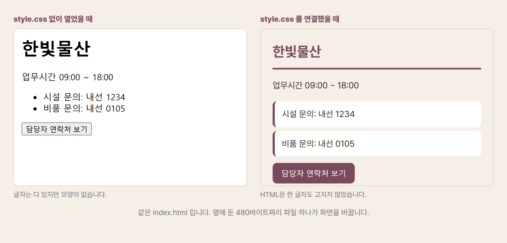

# 19. CSS — 같은 뼈대에 다른 옷

앞 장에서 만든 안내 페이지를 열어 보셨다면 표정이 좋지 않으셨을 겁니다. 내용은 다 들어 있는데 볼품이 없습니다. 제목은 지나치게 크고, 목록에는 까만 점이 붙어 있고, 글자는 화면 왼쪽 끝에 붙어 있습니다.

고장이 아닙니다. HTML은 **무엇이 제목이고 무엇이 목록인지만 말할 뿐**, 그것을 어떻게 보여 줄지는 말하지 않기 때문입니다. 브라우저가 아무 지시도 못 받았으니 자기 기본값대로 그린 것입니다.

보여 주는 방식을 정하는 파일이 따로 있습니다. `.css`입니다. 3장에서 전자책의 압축을 풀었을 때 본문 파일 옆에 있던 그것입니다.

## 이 장에서 만들 것

**사내 문서에 공통으로 입히는 서식 파일**입니다.

부서마다 만든 안내문이 글꼴도 색도 제각각이라 회사 문서처럼 보이지 않습니다. 공통 `.css` 파일을 하나 만들어 나눠 주면 각 부서는 내용만 쓰고 모양은 저절로 맞습니다.

그리고 이 파일의 맨 위에는 색과 글자 크기를 이름 붙여 모아 둡니다. **브랜드 색이 바뀌면 그 한 줄만 고치면 됩니다.** AI를 다시 부를 일이 없어집니다. 워드의 서식 파일을 나눠 주는 것과 같은 일인데, 고칠 때 한 번에 반영된다는 점이 다릅니다.

## 뼈대와 옷을 나눈 이유

제가 앞 장의 안내 페이지에 CSS 파일 하나를 옆에 두고 다시 열어 봤습니다. **HTML은 한 글자도 고치지 않았습니다.**



*그림 3. 같은 `index.html`입니다. 옆에 둔 480바이트짜리 파일 하나가 화면을 바꿉니다.*

이것이 CSS의 존재 이유입니다. **내용과 모양을 다른 파일로 갈라 두는 것**이지요. 갈라 두면 두 가지가 편해집니다. 회사 이름이 바뀌면 HTML만 고치면 되고, 브랜드 색이 바뀌면 CSS만 고치면 됩니다. 그리고 페이지가 백 장이어도 CSS 파일 하나만 고치면 백 장이 동시에 바뀝니다.

낯선 이야기가 아닙니다. 워드나 한글에서 **스타일**을 써 보셨다면 같은 발상입니다. 문단마다 일일이 글꼴과 크기를 지정하는 대신 "이건 제목1"이라고 표시해 두고, 제목1의 모양을 한 번에 바꾸는 방식 말입니다. CSS는 그것을 파일로 떼어 놓은 것입니다.

적는 방법도 단순합니다. **무엇을** 꾸밀지 적고, 중괄호 안에 **어떻게**를 적습니다.

```text
h1 { font-size: 26px; color: #7A4A5C; }
li { background: #ffffff; border-radius: 8px; padding: 10px; }
```

`h1`은 앞 장에서 본 큰 제목 이름표입니다. 그러니 위 두 줄은 "제목은 26픽셀 크기에 자주색으로, 목록 항목은 흰 바탕에 모서리를 둥글게 하고 안쪽 여백을 10픽셀 주라"는 뜻입니다. 영어 단어를 그대로 읽으면 대개 뜻이 통합니다.

실무에서 눈에 익혀 둘 것은 예닐곱 개면 충분합니다.

| 적는 말 | 정하는 것 |
|---|---|
| `color` | 글자 색 |
| `background` | 배경 색 |
| `font-size` | 글자 크기 |
| `padding` | 테두리 안쪽 여백 |
| `margin` | 테두리 바깥 여백 |
| `border` | 테두리 선 |
| `max-width` | 가로로 퍼지는 최대 너비 |

색은 `#7A4A5C`처럼 우물 정 자와 여섯 글자로 적습니다. 6장 SVG에서 사명과 함께 색 코드를 바꿔 로고를 바꿔 보셨다면 같은 표기입니다. 이 책에서 세 번째로 만나는 방식이니 이제 낯설지 않으실 겁니다.

[[TIP("손으로 해보기 · 옷 갈아입히기")]]
1. **앞 장에서 만든 `안내.html`을 준비합니다.**
2. **`<head>` 안에 한 줄을 넣습니다.** `<link rel="stylesheet" href="style.css">` 입니다. 옆에 있는 옷을 입겠다는 뜻입니다.
3. **같은 폴더에 `style.css`를 만듭니다.** 메모장으로 위의 두 줄을 적어 저장하세요.
4. **브라우저에서 `F5`를 누릅니다.** 제목 색과 목록 모양이 바뀝니다.
5. **색만 바꿔 봅니다.** `#7A4A5C`를 `#1B3A6B`으로 바꾸고 저장한 뒤 새로고침하세요. HTML은 손대지 않았는데 화면이 달라집니다.
[[/TIP]]

## 무엇으로 열고, 무엇으로 고치나

`.css`도 **메모장**으로 열리고 고쳐집니다. 이 부의 세 확장자가 전부 그렇습니다. 압축돼 있지도, 감춰져 있지도 않습니다.

편하게 작업하려면 **VS 코드**가 좋습니다. 색 코드 옆에 실제 색을 작은 네모로 보여 주고, 잘못 적은 곳에 밑줄을 그어 줍니다.

그런데 CSS에서 가장 요긴한 도구는 따로 있습니다. 브라우저의 **개발자 도구**입니다. 웹페이지에서 `F12`를 누르고 화면의 어느 부분을 고르면, 그 부분에 어떤 CSS가 적용돼 있는지 오른쪽에 나옵니다. 게다가 값을 그 자리에서 바꿔 결과를 바로 볼 수 있습니다. 파일을 고치는 것이 아니라 잠깐 흉내만 내 보는 것이라, 마음에 드는 값을 찾은 뒤 그 값을 파일에 옮겨 적으면 됩니다. **AI가 만들어 준 화면이 마음에 안 들 때 "여백을 얼마로 하면 좋을지"를 눈으로 찾는 가장 빠른 방법입니다.**

## 그래서 무엇을 자동화하나

CSS의 값어치는 **하나를 고쳐 전부를 바꾸는 것**에 있습니다.

**홍보팀의 브랜드 색 변경입니다.** 6장에서 로고 파일 수십 개의 색을 일괄로 바꾸는 이야기를 했지요. 사내에서 쓰는 안내 페이지와 보고서 서식이 열 종류쯤 된다면 같은 문제가 반복됩니다. 그런데 이것들이 CSS 파일 하나를 공유하고 있다면 색 코드 한 줄만 고치면 끝입니다. 실제로 실무에서는 색과 글꼴을 파일 맨 위에 이름을 붙여 모아 두는 방식을 씁니다. `--브랜드색: #7A4A5C`처럼 적어 두고 아래에서 그 이름을 부르는 것이지요. 그러면 고칠 곳이 정확히 한 줄이 됩니다.

**기획팀의 보고서 인쇄 서식입니다.** 11장에서 마크다운 원고 하나로 여러 형식을 만드는 이야기를 했습니다. 그 원고를 HTML로 바꿨을 때 인쇄하면 제목이 페이지 맨 아래에 혼자 남거나 표가 두 쪽에 걸쳐 잘리는 일이 생깁니다. 이런 것을 정하는 것도 CSS입니다. 실제로 지금 읽고 계신 이 책의 인쇄본도 CSS로 쪽 크기와 여백과 쪽번호를 정해 만들었습니다. 한 번 만들어 두면 원고가 늘어도 그대로 씁니다.

**총무팀의 사내 문서 통일입니다.** 부서마다 만든 안내문이 글꼴도 색도 제각각이라 회사 문서처럼 보이지 않습니다. 공통 CSS 파일을 하나 만들어 나눠 주면 각 부서는 내용만 쓰고 모양은 저절로 맞습니다. 워드의 서식 파일을 나눠 주는 것과 같은 일인데, 고칠 때 한 번에 반영된다는 점이 다릅니다.

사람과 AI의 몫은 이렇습니다. 어떤 색과 크기가 우리 회사에 맞는지, 결과가 보기에 괜찮은지 판단하는 일은 사람이 합니다. 그 결정을 규칙으로 적고 백 군데에 똑같이 적용하는 일은 AI가 합니다.

## AI에게 시키는 법

CSS에서 AI에게 시킬 때 가장 자주 실패하는 이유는 **막연하게 부탁하기 때문**입니다. "예쁘게 만들어 줘"라고 하면 AI의 취향이 나오고, 그 취향은 회사 문서와 맞지 않을 때가 많습니다.

```text
이 HTML에 붙일 style.css 를 만들어 줘.

지켜야 할 것:
· 브랜드 색은 #7A4A5C 하나만 쓰고, 나머지는 검정과 회색으로.
· 글꼴은 시스템 기본 산세리프로. 인터넷에서 받아 오지 마.
· 본문 가로 폭은 최대 700픽셀로 하고 가운데 정렬.
· 휴대폰 화면(가로 400픽셀)에서도 글자가 잘리지 않게.
· 색과 글꼴 크기는 파일 맨 위에 이름을 붙여 모아 두고,
  아래에서는 그 이름만 부르게 해 줘.
· 각 덩어리 앞에 "여기는 무엇을 정하는 부분"이라고 주석을 달아 줘.
```

두 번째 줄이 실무에서 중요합니다. 글꼴을 인터넷에서 받아 오게 만들면 **인터넷이 안 되는 사내망에서 글꼴이 깨집니다.** 그리고 다섯 번째 줄이 이 장의 핵심입니다. 색과 크기를 맨 위에 모아 두라고 하면, 나중에 브랜드 색이 바뀌었을 때 여러분이 직접 한 줄만 고치면 됩니다. AI를 다시 부를 일이 없어집니다.

한계도 적어 두겠습니다. CSS는 **배우기는 쉬운데 마음먹은 대로 배치하기는 어렵습니다.** 색과 크기를 바꾸는 일은 금방 익숙해지지만, 요소를 원하는 자리에 정확히 놓는 일은 규칙이 여럿 얽혀 있어 처음에는 잘 안 됩니다. 그럴 때는 붙잡고 씨름하는 대신 AI에게 화면을 캡처해 보여 주고 "이 부분이 이렇게 나오는데 이렇게 되면 좋겠다"고 말하는 편이 빠릅니다. 그리고 브라우저마다 미세하게 다르게 보일 수 있으니, 외부에 낼 페이지라면 크롬과 엣지에서 한 번씩 열어 확인하십시오.

## 잘 안 될 때

**사내망에서 글꼴이 깨집니다.** 글꼴을 인터넷에서 받아 오게 만든 것입니다. 회사 컴퓨터가 외부 인터넷을 막고 있으면 그 글꼴이 오지 않아 기본 글꼴로 나옵니다. "글꼴은 시스템 기본 산세리프로. 인터넷에서 받아 오지 마"를 조건에 넣으십시오.

**원하는 자리에 안 놓입니다.** 배치는 CSS에서 가장 까다로운 부분입니다. 혼자 씨름하지 말고 **화면을 캡처해 AI에게 보여 주며** "이 부분이 이렇게 나오는데 이렇게 되면 좋겠다"고 말하는 편이 훨씬 빠릅니다.

**인쇄하면 제목이 페이지 맨 아래에 혼자 남습니다.** 인쇄용 규칙을 따로 주지 않은 것입니다. "인쇄했을 때 제목이 혼자 남지 않게 해 줘"를 조건에 넣으면 됩니다.

**브라우저마다 다르게 보입니다.** 외부에 낼 페이지라면 크롬과 엣지에서 한 번씩 열어 확인하십시오.

## 눌러도 아무 일이 없습니다

앞 장에서 만든 페이지에는 단추가 하나 있었습니다. 이제 모양도 그럴듯해졌습니다. 그런데 눌러 보면 아무 일도 일어나지 않습니다.

HTML은 무엇이 있는지 말했고, CSS는 어떻게 보일지 말했습니다. 아직 **무슨 일이 일어날지**는 아무도 말하지 않았습니다. 그 일을 맡은 파일이 하나 더 있고, 이 책이 열일곱 장에 걸쳐 AI에게 만들라고 시켜 온 도구들의 정체가 사실 거기 있습니다.

**다음 장 →** **20. JS — 버튼을 눌렀을 때 일어나는 일**
